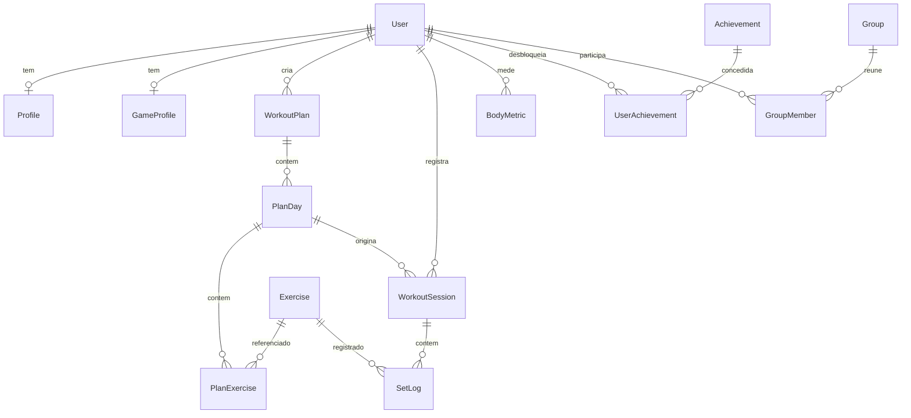

# RACK — ProjetoFit

Aplicativo de treino de musculação: biblioteca de exercícios, planos manuais ou gerados por IA, registro de séries com timer de descanso, gráficos de progressão e uma camada de gamificação com XP, conquistas e ranking entre amigos.

Feito mobile-first, instalável como PWA, e pensado para rodar local sem fricção.


---

## Índice

- [O que o app faz](#o-que-o-app-faz)
- [Stack](#stack)
- [Começando](#começando)
- [Variáveis de ambiente](#variáveis-de-ambiente)
- [Estrutura do repositório](#estrutura-do-repositório)
- [Modelo de dados](#modelo-de-dados)
- [API](#api)
- [Testes](#testes)
- [Decisões de projeto](#decisões-de-projeto)
- [Créditos](#créditos)
- [Licença](#licença)
- [Estado atual](#estado-atual)

---

## O que o app faz

| Área | O que entrega |
|---|---|
| **Biblioteca** | 873 exercícios com imagem, grupo muscular, equipamento e instruções de execução |
| **Planos** | Montagem manual (`/plans/new`) ou geração por IA a partir do perfil; um plano ativo por vez |
| **Agenda** | Cada dia do plano é fixado num dia da semana; o painel mostra o próximo treino |
| **Sessão** | Registro de série com carga/reps/RPE, carga pré-preenchida com a última usada, timer de descanso |
| **Progresso** | Volume por semana, evolução de carga por exercício, peso e composição corporal, detecção de PR, histórico |
| **Gamificação** | Sequência de dias, XP por treino, níveis, 12 conquistas |
| **Grupos** | Criar/entrar por código de convite, ranking por período e métrica, aviso de quem te ultrapassou |
| **PWA** | Instalável, com service worker e suporte offline |

A mascote **Rackie** reage ao que acontece: comemora série, PR, nível novo e conquista; fica triste quando alguém te passa no ranking.

---

## Stack

| Camada | Escolha |
|---|---|
| Monorepo | pnpm workspaces |
| Backend | NestJS 11 + Prisma 6 + PostgreSQL 17 |
| Frontend | Next.js 16 (App Router) + React 19 + Tailwind 4 |
| Estado/dados | TanStack Query 5 |
| Gráficos | Recharts |
| Contratos | Zod 4, compartilhado entre api e web via `@workout/shared` |
| IA | OpenAI structured outputs (`responses.parse` + `zodTextFormat`) |
| Auth | JWT (Passport) + bcrypt |
| Testes | Vitest (api) + Playwright (web) |

Todas as versões são fixas — sem `^` ou `~` em nenhum `package.json`.

---

## Começando

**Requisitos:** Docker, ou Node >= 20.11 + pnpm 10.15 + um Postgres.

### Docker (recomendado)

```bash
git clone <url-do-repo> && cd ProjetoFit
docker compose up
```

Sobe Postgres, API e web juntos, aplica as migrations e deixa o app em <http://localhost:3000>. A API responde em <http://localhost:3001/api>.

Popule a biblioteca de exercícios e o catálogo de conquistas (uma vez):

```bash
docker compose exec api pnpm --filter @workout/api prisma:seed
```

> **Windows:** o bind mount não propaga `inotify` e o Turbopack não suporta polling — o container `web` **não** tem hot-reload. Desenvolva com `pnpm dev` no host, ou rode `docker compose restart web` após alterar arquivos. A API tem hot-reload normalmente (usa polling).

### Local

```bash
pnpm install
# crie apps/api/.env com as variáveis da tabela abaixo
pnpm --filter @workout/api prisma:migrate
pnpm --filter @workout/api prisma:seed
pnpm dev
```

`pnpm dev` sobe `shared` (em watch), api e web em paralelo.

### Comandos úteis

```bash
pnpm build       # build de shared -> api -> web, nessa ordem
pnpm typecheck   # tsc --noEmit em todos os pacotes
pnpm lint        # eslint em todos os pacotes
pnpm db:migrate  # prisma migrate dev
```

---

## Variáveis de ambiente

**`apps/api/.env`**

| Variável | Obrigatória | Descrição |
|---|---|---|
| `DATABASE_URL` | sim | String de conexão do Postgres |
| `JWT_SECRET` | sim | Segredo de assinatura do token. A API **falha ao subir** sem ele |
| `JWT_EXPIRES_IN` | não | Validade do token (padrão `7d`) |
| `OPENAI_API_KEY` | não | Sem ela, tudo funciona; só a geração por IA responde `503` com uma mensagem explicando |
| `PORT` | não | Porta da API (padrão `3001`) |
| `WEB_ORIGIN` | não | Origem liberada no CORS (padrão `http://localhost:3000`) |

**`apps/web/.env.local`**

| Variável | Obrigatória | Descrição |
|---|---|---|
| `NEXT_PUBLIC_API_URL` | não | URL base da API (padrão `http://localhost:3001/api`) |

> A `OPENAI_API_KEY` fica **só no backend**. O Next nunca chama a OpenAI diretamente — toda geração passa pelo Nest, que também aplica o rate limit.

---

## Estrutura do repositório

```
apps/
  api/                 NestJS
    prisma/            schema, migrations e seed
    src/
      ai/              geração de plano (OpenAI structured outputs)
      auth/            registro, login, JWT
      common/          guards e mappers compartilhados
      exercises/       biblioteca
      game/            XP, níveis, conquistas
      groups/          grupos, convite, leaderboard
      metrics/         peso e composição corporal
      plans/           CRUD de planos e agenda
      progress/        volume, PRs, deload, sequência
      sessions/        sessão de treino e registro de série
    test/              e2e (Postgres real, banco separado)
  web/                 Next.js App Router
    e2e/               Playwright
    src/
      app/             rotas
      components/      UI, mascote, gráficos, grupos
      lib/             hooks de dados, auth, utilitários
packages/
  shared/              schemas Zod — o contrato entre api e web
docker/                Dockerfiles de dev e produção
```

`packages/shared` é a fonte da verdade dos tipos: os dois lados importam o mesmo schema, então um campo que muda no backend quebra o typecheck do frontend na hora.

---

## Modelo de dados



---

## API

Todas as rotas ficam sob o prefixo `/api` e exigem `Authorization: Bearer <token>`, exceto `/auth/register`, `/auth/login` e `/health`.

<details>
<summary><strong>Rotas</strong></summary>

| Método | Rota | O que faz |
|---|---|---|
| `GET` | `/health` | Healthcheck |
| `POST` | `/auth/register` | Cria conta |
| `POST` | `/auth/login` | Autentica |
| `GET` | `/auth/me` | Usuário do token |
| `GET` `PUT` | `/profile` | Perfil de treino |
| `GET` | `/exercises` · `/exercises/:slug` | Biblioteca |
| `GET` | `/plans` · `/plans/:id` · `/plans/next-workout` | Planos |
| `POST` `PUT` `DELETE` | `/plans` · `/plans/:id` · `/plans/:id/activate` | Gerência de planos |
| `POST` `PATCH` | `/sessions` · `/sessions/:id/logs` · `/sessions/:id/finish` | Sessão de treino |
| `GET` | `/sessions` · `/sessions/active` · `/sessions/last-loads` | Consulta de sessões |
| `GET` | `/progress/summary` · `/progress/deload` · `/progress/streak` · `/progress/exercise/:id` | Progressão |
| `GET` `POST` | `/metrics` | Peso e composição corporal |
| `GET` | `/game` · `/game/achievements` | XP, nível e conquistas |
| `POST` `DELETE` | `/groups` · `/groups/join` · `/groups/:id/leave` | Grupos |
| `GET` | `/groups` · `/groups/:id` · `/groups/:id/leaderboard` | Consulta de grupos |
| `POST` | `/ai/plans/generate` | Gera plano por IA (5/hora por usuário) |

</details>

**Convenções**

- Recurso de outro usuário responde **404**, nunca 403 — um 403 confirmaria que o id existe.
- Rate limit conta **por usuário**, não por IP: atrás de um proxy todo mundo dividiria a mesma cota.
- Toda entrada é validada com Zod na borda.

---

## Testes

```bash
pnpm --filter @workout/api test        # unitários (vitest) — puros, sem banco
pnpm --filter @workout/api test:e2e    # e2e da API contra Postgres real
pnpm --filter @workout/web test:e2e    # Playwright (mobile + desktop)
```

- Os **e2e da API** rodam num banco separado (`workout_test`) com `JWT_SECRET` gerado por execução — não existe segredo literal no repositório.
- Os **e2e do web** rodam em dois projetos, Pixel 5 e Desktop Chrome. O teardown apaga só os usuários `e2e-*@playwright.local`.
- Nenhum teste chama a OpenAI de verdade: todos os caminhos de `POST /ai/plans/generate` são interceptados no browser. Que a API responda `503` sem a chave é coberto pelos testes da própria API, onde nada é cobrado.

---

## Decisões de projeto

<details>
<summary><strong>Por que Postgres e não SQLite</strong></summary>

O plano original previa SQLite para "zero config". Com Docker o Postgres também é zero config, e evita a divergência de comportamento entre dev e produção — principalmente em transações e tipos de data.
</details>

<details>
<summary><strong>Por que o seed usa upsert e nunca deleteMany</strong></summary>

`PlanExercise` referencia `Exercise.id`. Apagar e recriar regeraria os `cuid()`, deixando planos de usuários apontando para o vazio. O `slug` (id do dataset) é a chave natural estável entre execuções. Vale o mesmo para conquistas, com `code` no lugar do slug.
</details>

<details>
<summary><strong>Como o XP é calculado</strong></summary>

`(50 + 5 × séries + 25 × PRs) × (1 + bônus de sequência)`, com o bônus em +2% por dia e teto de +50%. O teto existe para que uma sequência longa não transforme cada treino num evento desproporcional. Nível cresce em raiz: `⌊√(xp / 100)⌋ + 1`.
</details>

<details>
<summary><strong>Por que o aviso de ultrapassagem é uma faixa fixa, e não um balão da mascote</strong></summary>

O balão some sozinho em 2,2s, e o aviso precisa continuar visível enquanto a pessoa lê o ranking. Além disso, disparar o balão na montagem significaria setar estado dentro de um efeito, o que o React 19 barra com razão.

A ordem anterior mora no `localStorage`, então o aviso é **por dispositivo**: ver no celular e depois no computador mostra duas vezes. É o preço de não ter push.
</details>

<details>
<summary><strong>Por que a barra de navegação tem cinco itens</strong></summary>

Não é o alvo de toque — em 320px, seis colunas ainda dariam 53px cada, acima dos 44px recomendados. É o rótulo: "Biblioteca" em 10px com tracking passa de 53px e começaria a cortar. Perfil saiu para o header porque se mexe uma vez por mês; grupo se abre para ver se alguém te passou.
</details>

---

## Créditos

A biblioteca de exercícios (dados e imagens) vem do [free-exercise-db](https://github.com/yuhonas/free-exercise-db), de yuhonas. O seed baixa o dataset em tempo de execução e não redistribui os arquivos neste repositório — consulte a licença do projeto original antes de reutilizar as imagens.

---

## Licença

Todos os direitos reservados. Este repositório **não** tem arquivo `LICENSE`, e isso é deliberado: sem uma licença explícita, o código fica protegido por direito autoral e não pode ser usado, copiado ou redistribuído por terceiros.

Isso vale apenas para o código deste repositório. A biblioteca de exercícios é de terceiro — veja [Créditos](#créditos).

---

## Estado atual

O projeto foi construído em fases fechadas e testáveis, seguindo [`plano-implementacao-app.md`](plano-implementacao-app.md). As fases 0 a 8 estão concluídas: scaffold, biblioteca e perfil, planos manuais, sessão e timer, progresso, IA, polish/PWA, gamificação e grupos.

**Ainda não existe no repositório:**

- `apps/api/.env.example` — hoje o setup local depende de copiar as variáveis da tabela acima à mão
- Workflow de CI — typecheck, lint e testes são rodados manualmente
